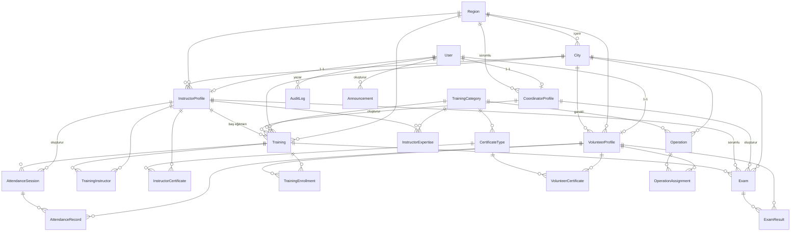

# ER Diyagramı

AFAD Gönüllü Eğitim Yönetim Sistemi ilişkisel veri modeli.

## Temel İlişki Notları

- `User` ile üç profil tablosu (`VolunteerProfile`, `InstructorProfile`, `CoordinatorProfile`) arasında bire-bir ilişki vardır; `role` alanı hangi profilin geçerli olduğunu belirler.
- `Training` bir `TrainingCategory`, bir `City`/`Region`, opsiyonel bir `CoordinatorProfile` (oluşturan) ve opsiyonel bir baş eğitmene (`InstructorProfile`) bağlıdır.
- `TrainingInstructor` çoktan-çoğa eğitim-eğitmen ilişkisini (`@@unique([trainingId, instructorId])`) sağlar.
- `TrainingEnrollment` gönüllü-eğitim kaydını benzersiz tutar (`@@unique([trainingId, volunteerId])`).
- `AttendanceSession` + `AttendanceRecord` yoklama oturumlarını ve katılımcı kayıtlarını tutar; mükerrer engeli composite unique ile sağlanır.
- `Exam` bir eğitime bağlıdır; `ExamResult` sınav-gönüllü sonucunu benzersiz tutar (`@@unique([examId, volunteerId])`).
- Tüm kritik işlemler `AuditLog` tablosuna yazılır.
